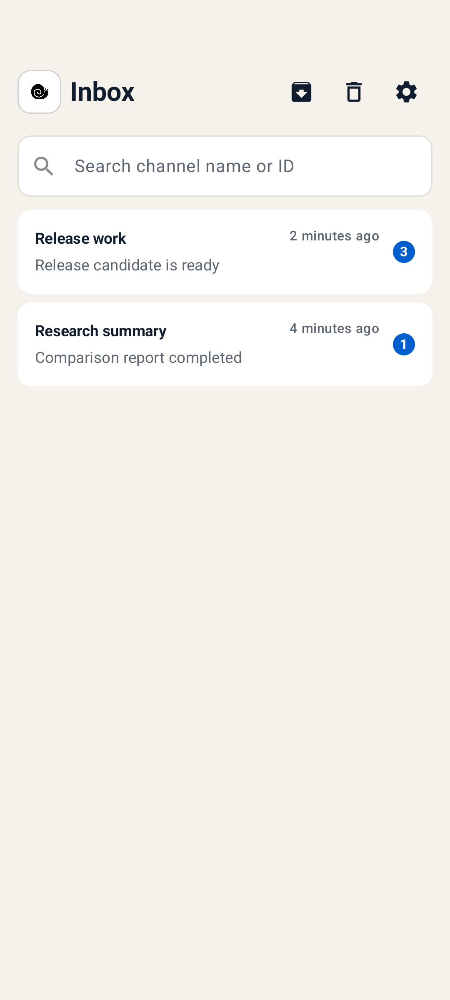
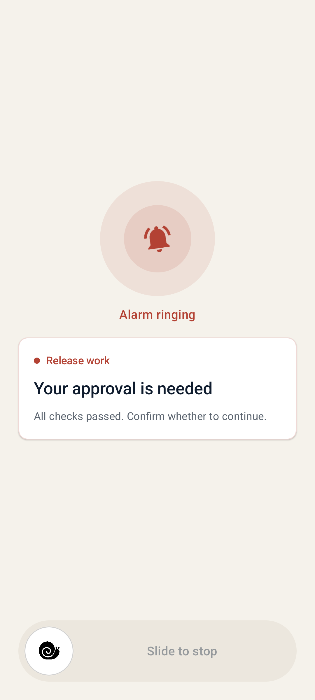
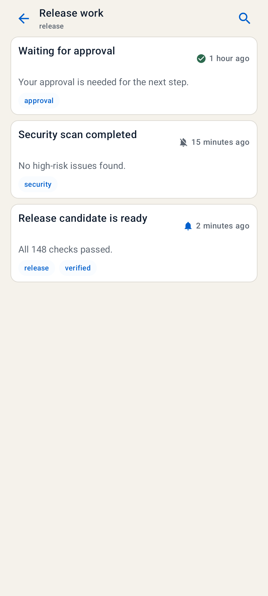
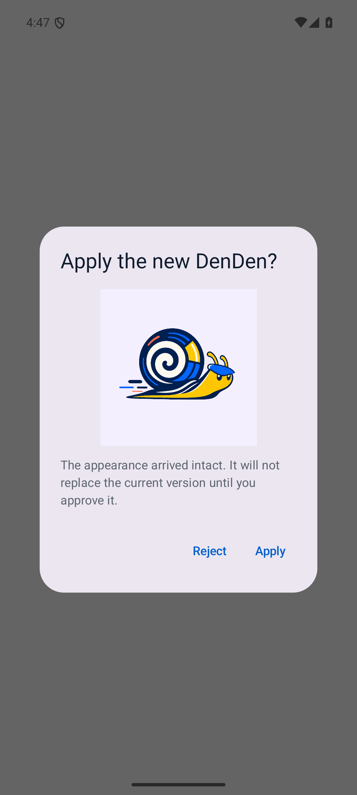

# DenDen

<p align="center">
  
</p>

<p align="center"><strong>Stop watching the screen. Let DenDen notify you when something matters.</strong></p>

<p align="center"><strong>English</strong> · <a href="README.zh-TW.md">繁體中文</a></p>

<p align="center"><a href="https://denden.tens.al">Official website</a></p>

## What is DenDen?

DenDen is an Android notification system. Your computer, AI assistant, and phone automations can use it to notify you when something important happens.

Choose a quiet notification, a standard notification, or an alarm for each kind of message. Messages that reach the phone appear in the DenDen inbox, where you can review the history of each task.

## Features

- Choose a quiet notification, standard notification, or alarm for each kind of message.
- Organize received messages by message channel. Search them, mark them as read, archive them, move them to Trash, or restore them.
- Preview and change the DenDen image and colors on your phone.
- Connect DenDen to Samsung Bixby Routines or Tasker automations so they can notify you when their conditions are met.

## Screenshots

The screenshots use fictional data.

<table>
  <tr>
    <td align="center"><strong>See received messages in one place</strong><br></td>
    <td align="center"><strong>Keep ringing when something needs attention</strong><br></td>
  </tr>
  <tr>
    <td align="center"><strong>Review the full history of a task</strong><br></td>
    <td align="center"><strong>Customize your own DenDen</strong><br></td>
  </tr>
</table>

## Get started

1. Open the [GitHub Releases page](https://github.com/hakendog/DenDen/releases) and download the latest DenDen APK.
2. Install and open DenDen on your Android phone, then allow notifications.
3. Copy the entire block below and paste it into an AI assistant that can operate your computer:

   ```text
   Please follow this DenDen installation guide and help me install and set up DenDen:

   https://raw.githubusercontent.com/hakendog/DenDen/9a4a84871737dfeeefdcb19913a2745fc712d7b4/docs/agent-install.md
   ```

4. The AI assistant checks your computer and shows a summary before making changes.
5. Review the summary and approve it when everything is correct.
6. Scan the DenDen pairing code shown by the AI assistant, then confirm the first test notification on your phone.

Setup is complete when the notification appears on your phone and the same message is visible in the DenDen inbox.

For a step-by-step explanation, read the [DenDen setup assistant guide](docs/en/setup.md).

### Two AI skills

DenDen separates setup authority from daily notification access:

- `denden-setup` installs, configures, pairs, and manages DenDen.
- `denden` sends routine work-result notifications with only low-privilege sender access.

The `denden-setup` skill can install the `denden` skill during initial setup or later.

## Use DenDen only on your phone

If you only use Samsung Bixby or Tasker, you only need the DenDen APK. You do not need a computer, Firebase, a DenDen pairing code, or an AI assistant.

When you first open DenDen, choose "Use local automation only."

Samsung Bixby can create a quiet message, standard notification, or alarm. Tasker also lets you set the title, message, and alarm duration. See [Bixby and Tasker](docs/en/local-automation.md).

## Important limits

- Remote notification content is encrypted on your computer, then sent to your phone through your own Firebase project.
- A phone that is offline cannot receive remote messages immediately. FCM may retain the encrypted message only for its validity window: up to five minutes for ordinary messages and one minute for ring and stop; expired messages are not delivered, and delivery is still not guaranteed.
- Received messages stay on the current phone and do not sync across phones.
- A DenDen pairing code contains pairing secrets. Do not capture, forward, or upload it.
- Network conditions, Android notification permissions, Do Not Disturb, and battery settings can delay or block notifications.
- Do not use DenDen for medical, life-safety, or any other purpose that requires guaranteed delivery.

See [Security and limitations](docs/en/security-and-limitations.md) for details.

## More information

### When can I use DenDen?

DenDen does not run tasks or monitor anything on its own. First configure a computer program, AI assistant, or automation tool. It can then notify you through DenDen when a condition is met.

- An AI assistant finishes a report, research task, code change, or other long-running work.
- An AI assistant needs you to sign in, approve access, or choose an option.
- A Codex usage limit resets and work can continue.
- A software build, test, or release succeeds or fails.
- A website, server, API, or scheduled job has a problem.
- Cloud service costs become unusual or approach a budget limit.
- A stock, exchange rate, or other price reaches a condition you set.
- A product is back in stock, its price drops, or ticket sales begin.
- A backup, sync, download, conversion, or batch job succeeds or fails.
- An automation detects a sign-in, service outage, or another event that needs review.
- Bixby or Tasker detects a phone state or routine condition.

### Does DenDen cost money?

No. DenDen works with the free Firebase Spark plan, which does not require a payment method.

Firebase Cloud Messaging is currently a no-cost product. Standard DenDen setup does not require the Blaze plan or any paid service. See the [Firebase pricing plans](https://firebase.google.com/docs/projects/billing/firebase-pricing-plans) for details.

### Documentation

Setup, daily use, troubleshooting, security limits, and CLI details are available in the [English documentation](docs/en/index.md).

## License

DenDen is licensed under the [Apache License 2.0](LICENSE). Copyright 2026 hakendog.
