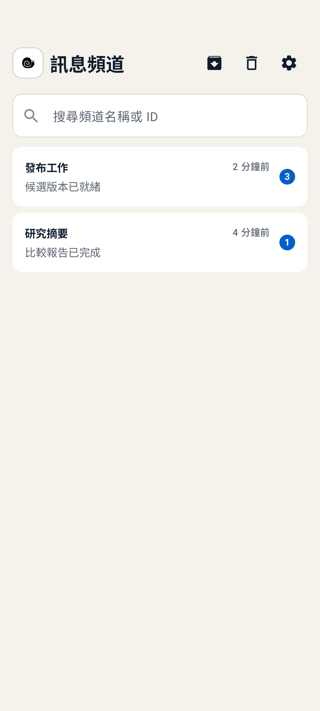
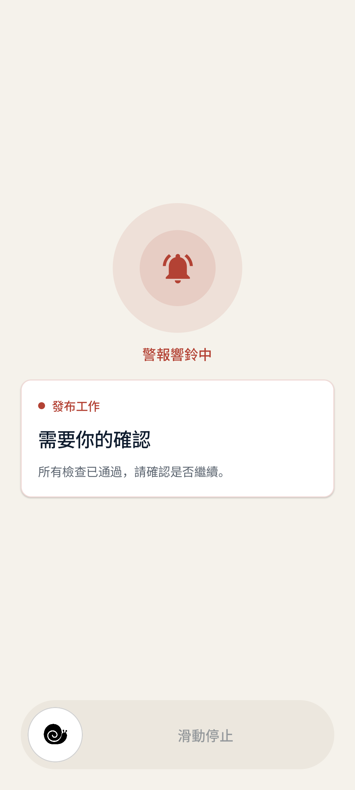
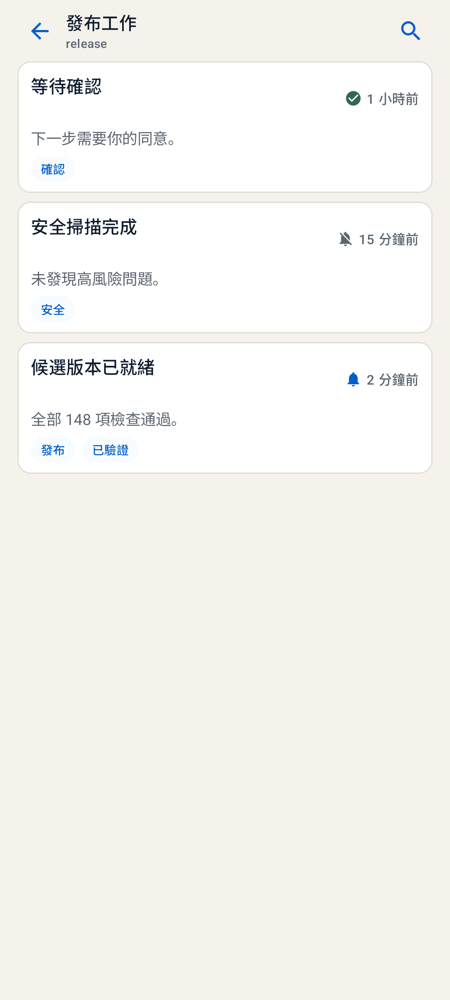
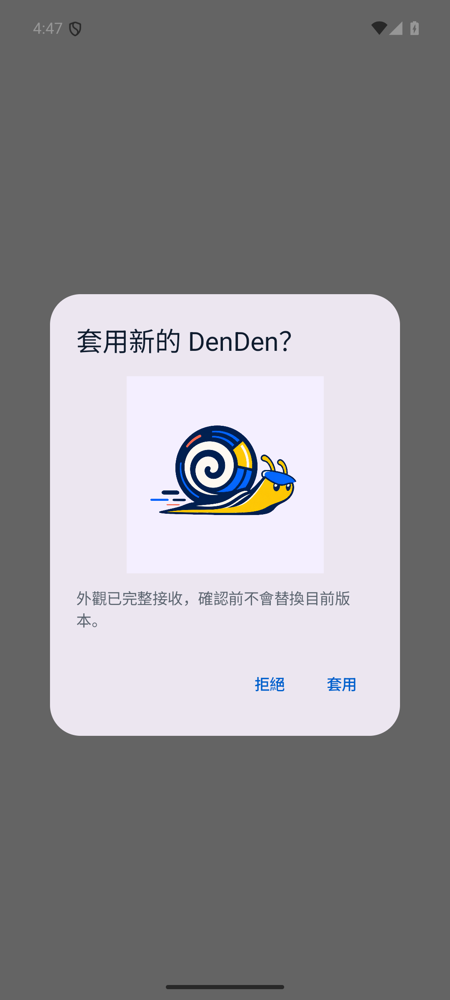

# DenDen

<p align="center">
  
</p>

<p align="center"><strong>不用守著螢幕，重要事項由 DenDen 通知你。</strong></p>

<p align="center"><a href="README.md">English</a> · <strong>繁體中文</strong></p>

## DenDen 是什麼

DenDen 是一套 Android 通知系統，讓電腦、AI 助理與手機自動化在重要事項發生時通知你。

你可以依情況選擇安靜通知、一般通知或響鈴。已成功送達的訊息會出現在 DenDen 收件匣，方便查看同一事項的紀錄。

## 特色

- 每種訊息都能分別選擇安靜通知、一般通知或響鈴。
- 已收到的訊息會依訊息頻道整理，可以搜尋、標示已讀、封存、移入垃圾桶或復原。
- 可在手機預覽並更換 DenDen 的圖片與色彩。
- 可將 DenDen 加入 Samsung Bixby 日常行程或 Tasker 自動化，在條件成立時通知或響鈴。

## 實際畫面

以下畫面使用虛構資料。

<table>
  <tr>
    <td align="center"><strong>集中查看已收到的訊息</strong><br></td>
    <td align="center"><strong>重要情況持續提醒</strong><br></td>
  </tr>
  <tr>
    <td align="center"><strong>查看同一工作的完整紀錄</strong><br></td>
    <td align="center"><strong>自訂自己的 DenDen</strong><br></td>
  </tr>
</table>

## 開始使用

1. 前往 [GitHub 發布頁](https://github.com/hakendog/DenDen/releases)，下載最新的 DenDen 手機安裝檔。
2. 在 Android 手機完成安裝並開啟 DenDen，再依畫面允許通知。
3. 將下面整段內容複製並貼給能操作你電腦的 AI 助理：

   ```text
   請根據以下 DenDen 安裝引導，協助我完成安裝與設定：

   https://raw.githubusercontent.com/hakendog/DenDen/881d5764ec80d3a75477e9e6ac083d9473691063/docs/agent-install.md
   ```

4. AI 助理會檢查電腦環境，並在進行變更前顯示摘要。
5. 確認摘要沒有問題後，同意 AI 助理繼續。
6. 使用手機掃描 AI 助理顯示的 DenDen 配對碼，再確認第一則測試通知。

手機顯示測試通知，而且 DenDen 收件匣看得到同一則訊息，就代表設定完成。

需要逐步說明時，請閱讀 [DenDen 設定助手](docs/zh-TW/setup.md)。

### 兩個 AI 技能

DenDen 將設定管理權限與日常通知權限分開：

- `denden-setup` 負責安裝、設定、配對與管理 DenDen。
- `denden` 只取得低權限的發送能力，用於日常發送工作結果通知。

`denden-setup` 可以在首次設定或日後替 AI 助理安裝 `denden`。

## 只在手機上使用

如果只使用 Samsung Bixby 或 Tasker，只需要安裝 DenDen 手機安裝檔，不需要電腦、Firebase、DenDen 配對碼或 AI 助理。

第一次開啟 DenDen 時，選擇「只使用本機自動化」即可。

Samsung Bixby 可以建立安靜通知、一般通知或響鈴提醒。Tasker 還能自訂標題、內容與響鈴時間。設定方式見 [Bixby 與 Tasker](docs/zh-TW/local-automation.md)。

## 重要限制

- 遠端通知內容會先在電腦上加密，再透過你自己的 Firebase 專案送到手機。
- 手機離線時無法立即收到遠端訊息。FCM 只會在加密內容的有效期限內暫存：一般訊息最多 5 分鐘，響鈴與停止最多 1 分鐘；過期後不會補送，且仍不保證送達。
- 已送達的訊息只會出現在目前手機，不會跨手機同步。
- DenDen 配對碼含有配對秘密。不要截圖、轉傳或上傳到其他服務。
- 網路、Android 通知權限、勿擾模式與省電設定都可能延遲或阻止通知。
- DenDen 不適用於醫療、生命安全或任何要求保證送達的用途。

完整說明見[安全與限制](docs/zh-TW/security-and-limitations.md)。

## 更多說明

### 可以用在哪些情境？

DenDen 不會自行執行工作或監控。你需要先設定電腦程式、AI 助理或自動化工具；完成設定後，它們才會在符合條件時透過 DenDen 通知你。

- AI 助理完成報告、研究、程式修改或其他長時間工作。
- AI 助理遇到登入、授權或選項，需要你回覆。
- Codex 使用額度重置，可以繼續執行工作。
- 程式建置、測試或發布完成或失敗。
- 網站、伺服器、API 或排程發生異常。
- 雲端服務費用異常或接近預算上限。
- 股票、匯率或其他價格到達你設定的條件。
- 商品補貨、價格下降或票券開始販售。
- 備份、同步、下載、轉檔或批次工作完成或失敗。
- 自動化偵測到帳號登入、服務中斷或其他需要確認的事件。
- Bixby 或 Tasker 偵測到手機狀態及日常行程條件。

### 需要付費嗎？

不需要。DenDen 使用 Firebase 的 Spark 免費方案即可運作，不需要綁定付款方式。

遠端通知使用的 Firebase Cloud Messaging 目前屬於免費產品。DenDen 的標準設定不會要求升級 Blaze 方案或啟用付費服務。詳情可查看 [Firebase 官方方案說明](https://firebase.google.com/docs/projects/billing/firebase-pricing-plans)。

### 說明文件

日常使用、疑難排解、安全限制與 CLI 技術說明都整理在[繁體中文文件](docs/zh-TW/index.md)。

## 授權

DenDen 以 [Apache License 2.0](LICENSE) 授權。Copyright 2026 hakendog。
