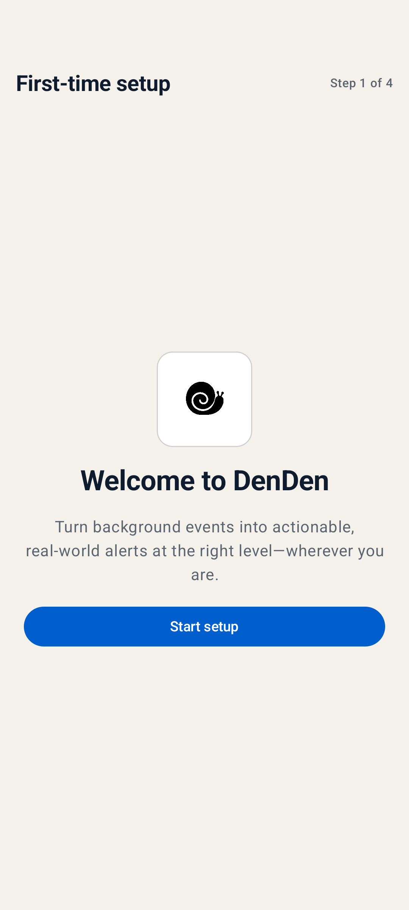

# Install and pair DenDen

The DenDen setup assistant guides you through phone installation, computer setup, and first-time pairing. Important changes are shown in a summary and do not run until you approve them.

You can tell the AI assistant to cancel at any time. Changes you have not approved will not run.

## Install DenDen on your phone

DenDen supports Android 8.0 and later:

1. Open the [GitHub Releases page](https://github.com/hakendog/DenDen/releases) and download the latest DenDen APK.
2. Complete the installation in Android.
3. Open DenDen and allow notifications.
4. Choose remote notification pairing, or use Bixby and Tasker without pairing.

<p align="center">
  
</p>

If you only use Bixby or Tasker on the phone, setup is complete. You do not need a Google account or computer. See [Bixby and Tasker](local-automation.md).

## Install and pair DenDen

Remote notifications from a computer or AI assistant require Google Play services on the phone. The computer can run Windows, macOS, or Linux. Before you begin, have a Google account and an AI assistant that can operate your computer.

### 1. Ask the AI assistant to begin

Copy the entire block below and paste it into the AI assistant:

```text
Please follow this DenDen installation guide and help me install and set up DenDen:

https://raw.githubusercontent.com/hakendog/DenDen/6aa2612514f69e4328da4781be84f3c54b510d1b/docs/agent-install.md
```

The AI assistant reads the installation guide, loads the DenDen setup assistant, and starts checking the computer.

This check does not change your Google account, create a project, or write settings. If a required tool is missing, the AI assistant explains its purpose and what it would install before asking whether to continue.

### 2. Sign in to Google

After the check, your browser opens the Google sign-in and authorization page. This sign-in is used only for DenDen setup. It does not reuse an account already connected to the AI assistant.

Choose the Google account that will manage the DenDen project and sign in through the browser. Enter passwords and verification codes yourself. The AI assistant does not need them.

### 3. Choose a project for DenDen

DenDen needs a dedicated Google project to send notifications. You can:

1. Create a new project dedicated to DenDen. This is the recommended choice.
2. Use a dedicated existing project that you select. The setup assistant checks whether it is suitable for DenDen.

The setup assistant does not choose or change another existing project on its own. Standard setup uses the free plan, does not connect a payment method, and does not enable paid services.

If Google requires you to accept Firebase terms first, the AI assistant takes you to the correct page. Complete only the items required by DenDen. You do not need to enable Analytics or other AI features.

### 4. Choose daily notifications

The setup assistant asks whether to install the daily DenDen notification feature for the current AI assistant. Once installed, the assistant can notify your phone when work completes, fails, becomes blocked, or needs your reply. You can choose another installation location or skip this step and install it later.

If you install it, choose one notification policy:

1. Send a quiet notification whenever work completes, and a standard notification for other results.
2. Notify you of completion only when work takes longer than one minute, and use a standard notification for other results.
3. Notify you only when work fails, is blocked, needs your reply, or when you request a notification.
4. Choose a notification method for each result.

Alarms are off by default. The setup assistant enables them only for situations you explicitly choose.

### 5. Choose a DenDen image

During installation, you can:

- Use the built-in DenDen.
- Generate a new DenDen image.
- Generate an image from your instructions.
- Import a transparent PNG image.
- Use the default image and change it later.

If an external image service needs to receive any material, the setup assistant tells you what will be uploaded and waits for your approval. Generated artwork is made transparent first, then composited onto white locally for review. Choosing to adopt that preview applies the same transparent artwork; it does not generate the image again.

### 6. Review the setup summary

Before making changes, the AI assistant shows a complete summary that includes:

- The Google project it will create or use.
- The settings it will add to this computer.
- Whether it will install daily notifications and which notification policy it will use.
- The selected DenDen image.
- The phone pairing and notification test that remain.

Read the summary. If everything is correct, reply:

```text
I approve
```

If anything is unclear or needs to change, ask the AI assistant to explain or update it before you approve.

### 7. Complete computer setup

After approval, the AI assistant creates or configures the project dedicated to DenDen and gives this computer its own notification permission. It then removes the temporary Google administrative access used for setup. Daily notifications never receive that administrative access.

If a step cannot be completed, the AI assistant stops and explains the problem. It does not report an incomplete setup as successful.

### 8. Pair the phone

When computer setup is complete, the conversation shows a short-lived DenDen pairing code. Do not capture, forward, or upload it.

Complete these steps on your phone:

1. Open the installed DenDen app.
2. Follow the screen to allow notifications if needed.
3. Choose to scan the DenDen pairing code.
4. Check the project details shown by the phone, then confirm pairing.

The phone does not need to use the same network as the computer. After pairing succeeds, the pairing code image is deleted from the computer.

### 9. Confirm the test notification

The setup assistant sends a standard test notification. Confirm that the notification appears on your phone and that its content is correct in DenDen.

Installation and pairing are complete only after the phone receives this notification. If it does not arrive, the setup assistant identifies the step that failed and continues checking from the current state.

## Next steps

- [Add or manage phones and computers](device-management.md)
- [Change notifications, images, or backup settings](preferences-and-backup.md)
- [Troubleshooting](troubleshooting.md)
