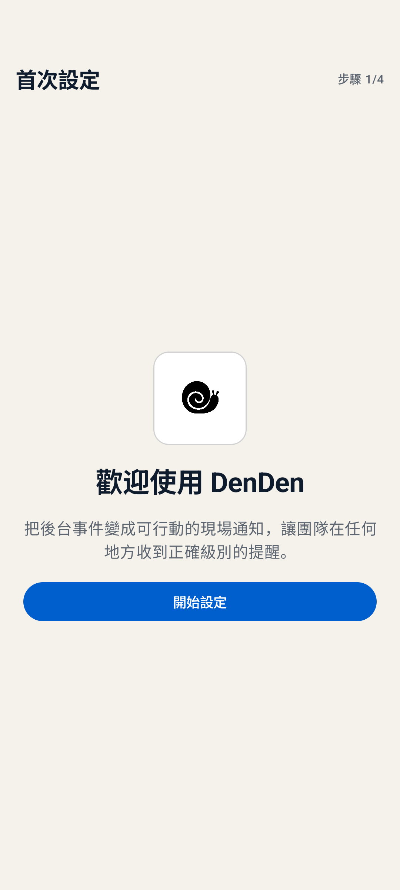

# 安裝與首次配對

DenDen 設定助手會帶你完成手機安裝、電腦設定與首次配對。任何重要變更都會先顯示摘要，等你同意後才執行。

如果不想繼續，直接告訴 AI 助理取消即可。尚未同意的變更不會執行。

## 在手機安裝 DenDen

DenDen 支援 Android 8.0 以上版本：

1. 前往 [GitHub 發布頁](https://github.com/hakendog/DenDen/releases)，下載最新的 DenDen 手機安裝檔。
2. 使用 Android 的安裝畫面完成安裝。
3. 開啟 DenDen 並允許通知。
4. 選擇配對遠端通知，或直接使用 Bixby 與 Tasker。

<p align="center">
  
</p>

只使用手機上的 Bixby 或 Tasker 時，到這裡就完成了，不需要 Google 帳戶或電腦。設定方式見 [Bixby 與 Tasker](local-automation.md)。

## 安裝並配對 DenDen

要接收電腦或 AI 助理的遠端通知，手機需要 Google Play 服務。電腦支援 Windows、macOS 與 Linux。開始前請準備 Google 帳戶，以及能協助操作電腦的 AI 助理。

### 1. 請 AI 助理開始安裝

將下面整段內容複製並貼給能操作你電腦的 AI 助理：

```text
請根據以下 DenDen 安裝引導，協助我完成安裝與設定：

https://raw.githubusercontent.com/hakendog/DenDen/881d5764ec80d3a75477e9e6ac083d9473691063/docs/agent-install.md
```

AI 助理讀取安裝引導後，會載入 DenDen 設定助手並開始檢查。

這個階段只會查看電腦是否具備需要的工具，不會直接變更 Google 帳戶、建立專案或寫入設定。若缺少必要工具，AI 助理會先說明用途與安裝內容，再詢問是否處理。

### 2. 登入 Google

檢查完成後，瀏覽器會開啟 Google 登入與授權頁面。這次登入只供 DenDen 設定使用，不會沿用 AI 助理平常登入的帳戶。

請選擇要管理 DenDen 專案的 Google 帳戶，並在瀏覽器中完成登入。密碼與驗證碼由你直接輸入，AI 助理不需要知道。

### 3. 選擇 DenDen 專用專案

DenDen 需要一個專用的 Google 專案傳送通知。你可以選擇：

1. 建立一個新的 DenDen 專用專案。這是建議選項。
2. 使用你指定的既有專案。設定助手會先確認該專案適合 DenDen 使用。

設定助手不會自行挑選或改動其他既有專案。標準設定使用免費方案，不會連結付款方式，也不會開啟付費服務。

如果 Google 要求先接受 Firebase 使用條款，AI 助理會帶你前往正確頁面。只需要完成 DenDen 所需的項目，不必開啟 Analytics 或其他 AI 功能。

### 4. 選擇日常通知方式

設定助手會詢問是否要替目前的 AI 助理安裝 DenDen 日常通知功能。安裝後，AI 助理才能在工作完成、失敗、受阻或需要你回覆時通知手機。你也可以指定其他安裝位置，或先略過，之後再安裝。

如果選擇安裝，可以直接使用其中一種通知方式：

1. 每次工作完成時安靜通知，其他結果顯示一般通知。
2. 工作超過一分鐘才通知完成，其他結果顯示一般通知。
3. 只通知失敗、受阻、需要回覆與手動通知。
4. 逐項自訂每種情況的通知方式。

響鈴預設關閉。只有你明確指定哪些情況可以響鈴時，設定助手才會啟用。

### 5. 選擇 DenDen 圖片

你可以在安裝時選擇 DenDen 顯示的圖片：

- 使用內建 DenDen。
- 產生一張新的 DenDen 圖片。
- 依照你指定的條件產生圖片。
- 匯入一張透明背景的 PNG 圖片。
- 先使用預設圖片，之後再更換。

若產生圖片需要把素材送到外部圖片服務，設定助手會先告訴你會上傳什麼內容，取得同意後才繼續。生成時會使用角色完全沒用到的高反差純色背景；去背後必須確認兩顆臉部眼睛及其他細節都完整，再由本機把同一張透明圖合成白底預覽供你確認。選擇採用後會直接套用原透明圖，不會重新產生。AI 助理本身無法產生圖片時，會改給你完整提示詞與參考遮罩的位置；你可以自行產生圖片，再把原始透明 PNG 附回對話，或存到設定助手指定的本機路徑。

### 6. 確認設定摘要

開始變更前，AI 助理會顯示一份完整摘要，內容包括：

- 要建立或使用哪一個 Google 專案。
- 會在這台電腦加入哪些設定。
- 是否安裝日常通知功能，以及通知偏好。
- 要使用哪一種 DenDen 圖片。
- 接下來需要完成的手機配對與測試。

請先讀完摘要。確認內容正確後，回覆：

```text
同意
```

如果有任何不清楚或想修改的地方，先請 AI 助理解釋或調整，不要回覆同意。

### 7. 完成電腦設定

收到同意後，AI 助理才會建立或設定 DenDen 專用專案，並在目前這台電腦安裝共用的最低權限發送資格。完成後，它會清除這次設定暫存在電腦上的 Google 管理授權，不會把這份管理權限交給日常通知功能。

若其中一個步驟無法完成，AI 助理會停在原處並說明原因，不會把尚未完成的設定當成安裝成功。

### 8. 配對手機

電腦設定完成後，畫面會顯示一張短期有效的 DenDen 配對碼。請勿截圖、轉傳或上傳這張圖片。

接著在手機上完成以下操作：

1. 開啟已安裝的 DenDen。
2. 如果尚未允許通知，依畫面完成設定。
3. 選擇掃描 DenDen 配對碼。
4. 核對手機顯示的專案資料，再確認配對。

手機不必與電腦連接同一個網路。配對成功後，電腦上的配對碼圖片會被刪除。

### 9. 確認測試通知

設定助手會傳送一則一般測試通知。請確認手機有顯示通知，並在 DenDen 中確認內容正確。

收到測試通知後，安裝與配對才算完成。如果沒有收到，設定助手會指出卡住的步驟，並從目前狀態繼續檢查。

## 接下來

- [新增或管理手機與電腦](device-management.md)
- [調整通知、更換圖片或備份設定](preferences-and-backup.md)
- [疑難排解](troubleshooting.md)
